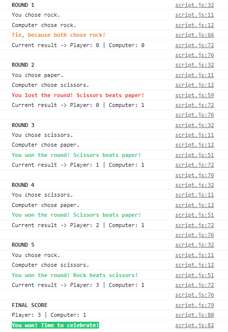

# [Rock Paper Scissors](https://gdimitroff.github.io/rock-paper-scissors/)

### Project task

Create a simple implementation of Rock-Paper-Scissors game from The Odin Project [curriculum](https://www.theodinproject.com/paths/foundations/courses/foundations/lessons/rock-paper-scissors).

### First stage | Game in the browser console

**The benefits I got from this stage:**

- Deepened knowledge of how **functions work** with each other.
- Learned how to style the **console text**.

### Second stage | Game with added UI

**The benefits I got from this stage:**

- Deepened knowledge of how to structure my **HTML, CSS and JavaScript** code.
- Deepened knowledge of **CSS transform** and **transition** effects.
- Learned basic **manipulations of elements styles** through JavaScript code (setting attributes, adding/removing classes, changing inline styles and texts).
- Improved my **understanding of JavaScript functions** (organization, workspaces, scopes, calling, invoking, breaking down into smaller ones..).

### Summary

- For a more playful experience, **theme was changed** to be more colorful.
- The game has a **responsive layout** with three breakpoints.
- The game is **fully playable** in the browser window and on the majority of the mobile devices.
- I really tried to keep **readable and understandable code**, **short functions**, **descriptive names** and **colorful mood** of the game.
